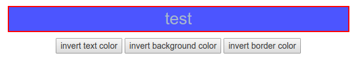
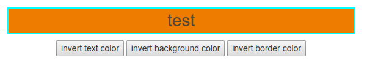

# invert-rgb
> inverts color of the given DOM element


### Installation
    npm install invert-rgb


##### supported color formats
* Hexadecimal `#f0f, #ff00ff`
* RGB `rgb(255, 255, 255)`
* RGBA `rgba(0, 0, 0, 0.5)`
* HSL `hsl(120, 100%, 50%) /* green */`
* HSLA `hsla(120, 100%, 50%, 0.3) /* green with opacity */`
* Predefined/Cross-browser color names `red, green, blue`

### Usage 
```js
const { invertRgb } = require('invert-rgb')
let element = document.getElementById('#test') 
invertRgb(element, 'border-color') /* red -> rgb(255, 0, 0) -> rgb(0, 255, 255) */ 
```


### Demo


before





after



